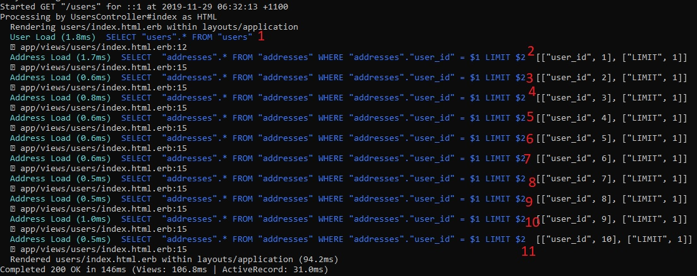
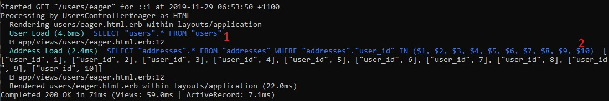

# Eager loading

## 1. The n + 1 problem

The n + 1 problem describes an issue in querying a relational database where many additional queries must be made to a table related to an original table for more information.

For example, lets say we have a users table with 10 records. Each of these users has an address, so we also have an addresses table with an address for each user, which references the users table with a foreign key.

When we want to find the addresses of our 10 users we have to make 1 query to get the users, then for each user we must make an additional query to get the address. This results in 11 (i.e. n + 1) queries.

## 2. Lazy loading

For our example, we want to print all users and addresses to the page.

In our controller we have this method, which we are using to send information on our users to the view:
```Ruby
def index
    @users = User.all
end
```

In our view we are iterating over our array of users and using dot notation to query their addresses:
```html
<% @users.each { |user| %>
    <tr>
        <td><%= user.name %></td>
        <td><%= user.address.street %></td>
        <td><%= user.address.city %></td>
    </tr>
<% } %>
```

The number of queries required to render this page can be observed from the terminal. For our addresses on 10 users, we observe 11 queries:


## 3. Eager loading

We will render all the same information to the page, but this time we will use eager loading to reduce the number of queries to the database.

In our controller, we now use the method 'includes' to eager load the associations we want. We know in advance that we want the addresses on our users, so we simply include the name of the model as the argument to includes.
```Ruby
def eager
    @users = User.includes(:address).all
end
```

This reduces the number of database queries to the following:
