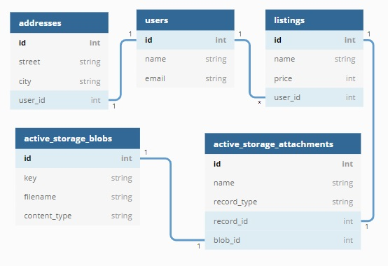
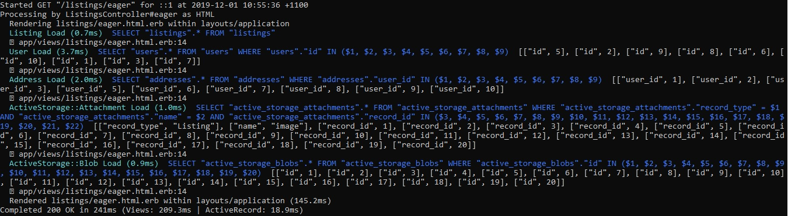

# Eager loading

## 1. The n + 1 problem

The n + 1 problem describes an issue in querying a relational database where many additional queries must be made to a table related to an original table for more information.

For example, lets say we have a users table with 10 records. Each of these users has an address, so we also have an addresses table with an address for each user, which references the users table with a foreign key.

When we want to find the addresses of our 10 users we have to make 1 query to get the users, then for each user we must make an additional query to get the address. This results in 11 (i.e. n + 1) queries.

## 2. Lazy loading

For our example, we want to print all users and addresses to the page.

In our controller we have this method, which we are using to send information on our users to the view:
```Ruby
def index
    @users = User.all
end
```

In our view we are iterating over our array of users and using dot notation to query their addresses:
```html
<% @users.each { |user| %>
    <tr>
        <td><%= user.name %></td>
        <td><%= user.address.street %></td>
        <td><%= user.address.city %></td>
    </tr>
<% } %>
```

The number of queries required to render this page can be observed from the terminal. For our addresses on 10 users, we observe 11 queries:


## 3. Eager loading

We will render all the same information to the page, but this time we will use eager loading to reduce the number of queries to the database.

In our controller, we now use the method 'includes' to eager load the associations we want. We know in advance that we want the addresses on our users, so we simply include the name of the model as the argument to includes.
```Ruby
def eager
    @users = User.includes(:address).all
end
```

This reduces the number of database queries to the following:


## 4. Advanced eager loading: multiple associations and nested associations

Rails active record also gives us the ability to eager load multiple associations and nested associations.

Let's consider the following database:



We want to load:
- all listings
- all images on the listings 
- all users on these listings
- all addresses on these users

This will require us to load multiple associated tables (users and image_attachments) and multiple tables attached to those tables (addresses and blobs). We could use lazy loading as follows:
```Ruby
def index
    @listings = Listing.all
end
```

However this produces 101 queries.
- 1 for listings
- 20 for users (because we have 20 listings, each with 1 user)
- 20 for addresses (20 users each with 1 address)
- 20 for active storage attachments (20 listings each with 1 attachment)
- 20 for active storage blobs (20 attachments each with 1 image)
- 20 for additional searches for blobs because the images must be access from storage

Fortunately, we can improve this with eager loading. Once we have identified the tables which must be eager loaded, we include them in the database call with the following syntax:
```Ruby
def eager
    @listings = Listing.includes(:user => :address, :image_attachment => :blob).all
end
```

This eager loads user and address (which is a nested association of user i.e. addresses does not have a foreign key for listings) and image_attachments and blob. Image_attachment and blob are the way we reference the Active Storage tables, i.e. active_storage_attachments and active_storage_blobs. In our case the association is called 'image' attachment as opposed to some other type of attachment because of the relationship we wrote into the listing model.
```Ruby
class Listing < ApplicationRecord
  belongs_to :user
  has_one_attached :image
end
```

This produces a total of 26 database queries:
- 1 for listings
- 1 for users
- 1 for addresses
- 1 for active storage attachments
- 1 for active storage blobs
- 20 for additional searches for blobs because the images must be access from storage (not shown in screenshot due to space limitations)

